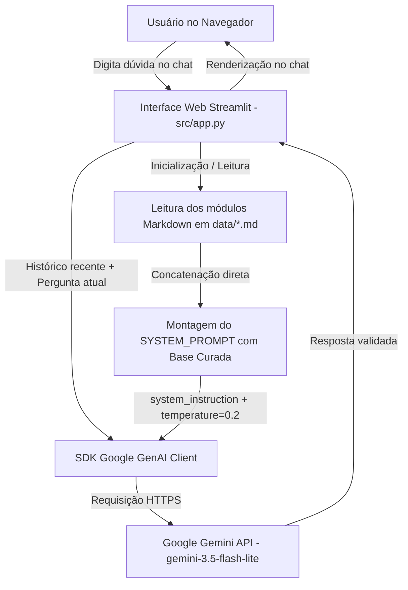

# Arquitetura do CyberGuide AI

Este documento detalha o funcionamento interno, o fluxo de dados e a organização estrutural do **CyberGuide AI**.

---

## 1. Fluxo de Dados e Interação

O CyberGuide AI adota uma arquitetura intencionalmente simples, direta e desacoplada, priorizando facilidade de execução local, transparência e controle estrito sobre o contexto educacional:



### Detalhes do Funcionamento

1. **Carregamento da Base:** Ao inicializar, a função `carregar_base_conhecimento()` em `src/app.py` lê todos os arquivos `.md` do diretório `data/` usando `pathlib.Path` de forma agnóstica ao sistema operacional e os concatena em uma única string de referência.
2. **Instrução de Sistema (`system_instruction`):** O conteúdo da base e as regras de postura educacional, limites de escopo e conduta ética compõem a constante `SYSTEM_PROMPT`, enviada como instrução de sistema nativa da API Gemini.
3. **Gerenciamento de Contexto:** O histórico de conversa é mantido na sessão do Streamlit (`st.session_state.historico`). Para preservar a clareza e evitar consumo desnecessário de contexto, a aplicação envia as últimas 6 mensagens como histórico conversacional junto à nova pergunta.
4. **Tratamento de Exceções:** A função `perguntar()` intercepta erros de cota (429 / RESOURCE_EXHAUSTED), chaves ausentes ou inválidas e falhas de conexão de rede, exibindo alertas amigáveis e orientações de solução diretamente na interface.

---

## 2. Decisão Arquitetural: Contexto Direto vs. RAG Tradicional

Nesta versão do protótipo, **não** foi utilizado um pipeline complexo de RAG (Retrieval-Augmented Generation) com embeddings e banco de dados vetorial.

* **Motivação:** A base de conhecimento curada possui 7 módulos focados e objetivos (aproximadamente 30 KB no total). Esse volume cabe com folga na janela de contexto de milhões de tokens da família Gemini.
* **Vantagens:** Elimina dependências externas pesadas (sem ChromaDB, FAISS ou Pinecone), reduz a latência de busca, simplifica a instalação para qualquer usuário e garante que o modelo tenha visão holística das interações entre programação, redes e segurança.
* **Evolução Futura:** Caso a base de conhecimento seja expandida para centenas de manuais, normas ou livros técnicos extensos, a transição para busca vetorial com embeddings poderá ser avaliada.

---

## 3. Estrutura de Pastas e Arquivos

```text
ciberguide-ia/
│
├── data/                             # Base de conhecimento curada (Markdown)
│   ├── devsecops.md                  # CI/CD, SAST, DAST, Secrets, GitHub Actions
│   ├── ferramentas.md                # Nmap, Wireshark, Burp Suite, Kali Linux, Docker
│   ├── fundamentos-cyber.md          # Tríade CIA, vulnerabilidades, hashing, pentest
│   ├── laboratorios.md               # Juice Shop, DVWA, PortSwigger Academy
│   ├── programacao.md                # JavaScript, Node.js, REST, Git, MongoDB
│   ├── redes.md                      # IP, portas, DNS, TCP/UDP, HTTP/HTTPS
│   └── seguranca-web.md              # OWASP Top 10, SQLi, XSS, CSRF, JWT
│
├── docs/                             # Documentação técnica e entregáveis DIO
│   ├── arquitetura.md                # Este documento de arquitetura e decisões
│   ├── avaliacao-metricas.md         # Metodologia e matriz de 20 casos de teste
│   ├── documentacao-agente.md        # Passo 1: Especificação e objetivos do agente
│   ├── pitch.md                      # Passo 6: Apresentação e roteiro do projeto
│   └── prompts.md                    # Passo 3: Engenharia de prompts e conduta
│
├── src/                              # Código-fonte da aplicação
│   ├── app.py                        # Passo 4: Aplicação Streamlit integrada ao Gemini
│   └── README.md                     # Guia rápido de execução do módulo src
│
├── .env.example                      # Modelo para configuração de variáveis de ambiente
├── .gitignore                        # Proteção de credenciais, caches e ambientes
├── README.md                         # Portal principal e apresentação do repositório
└── requirements.txt                  # Dependências Python mínimas e essenciais
```
